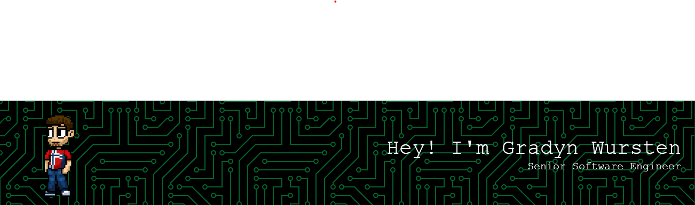

# 👋 Hi, I'm Gradyn Wursten

## 🚀 About Me

I'm a **Senior Software Engineer at [Sunlight Solutions](https://sunlightsolutions.com/)**, passionate about building robust, scalable solutions. My expertise spans **C#**, **Java**, and the modern JavaScript ecosystem—especially **Next.js** and **React**.

- 🌟 **Star Contributor** at [Reactiflux](https://www.reactiflux.com/) (the largest React developer community)
- 💡 Always open to collaboration and new opportunities
- 🌱 Currently working on a massive new project—stay tuned!

## 🛠️ Tech Stack

## 🌐 Connect with Me

- 🌍 [gradyn.com](https://gradyn.com)
- 💼 [LinkedIn](https://www.linkedin.com/in/gradyn-wursten-84b49920a)
- 🐦 [Bluesky](https://bsky.app/profile/gradyn.com)

## 🤝 Let's Collaborate!

I'm always interested in connecting with fellow engineers, discussing new ideas, and contributing to exciting projects. Whether you want to chat about tech, start a project together, or need some advice—**reach out!**

---

